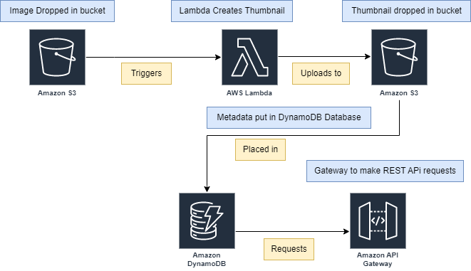

<!--
title: 'AWS Python Example'
description: 'This template demonstrates how to deploy a Python function running on AWS Lambda using the traditional Serverless Framework.'
layout: Doc
framework: v3
platform: AWS
language: python
priority: 2
authorLink: 'https://github.com/serverless'
authorName: 'Serverless, inc.'
authorAvatar: 'https://avatars1.githubusercontent.com/u/13742415?s=200&v=4'
-->

# AWS Lambda Thumbnail Generator

The serverless template created via the [Serverless Framework](https://github.com/serverless)
## Steps:

1. An image is dropped in an S3 bucket
2. The lambda function is triggered. The lambda fn creates a thumbnail of the image and drops the thumbnail in the S3 bucket.
3. Metadata about the image is added to a DynamoDB table (such as creation time, id etc.)
4. The thumbnails can be accessed and deleted by ID via an API Gateway. All thumbnails can also be listed. 

Figure 1. Diagram showing high-level overview. 
### Useful Commands: 
serverless plugin install -n serverless-python-requirements

pip freeze | Out-File -Encoding UTF8 requirements.txt

serverless deploy function -f thumbnail_generator

serverless remove